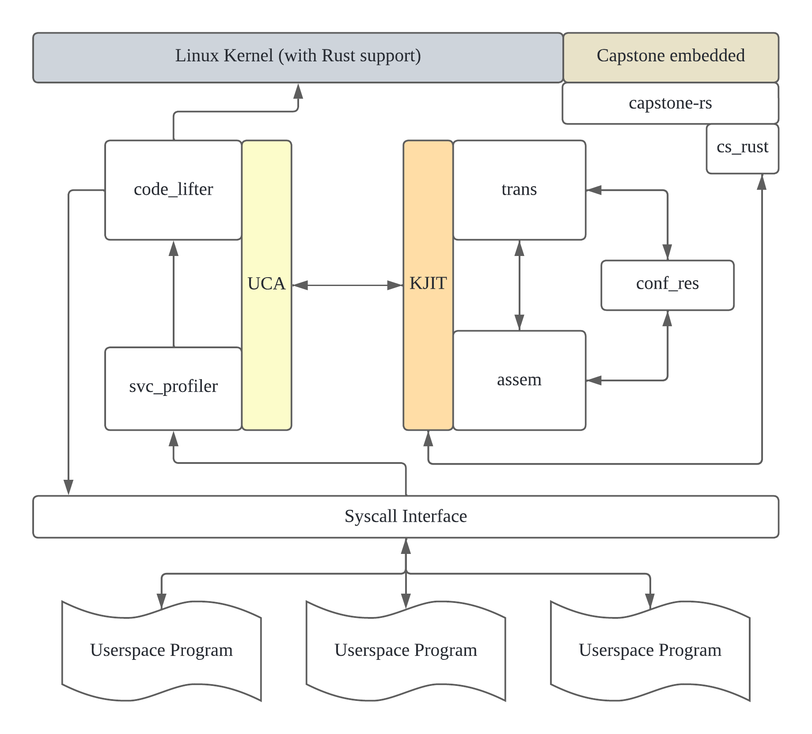
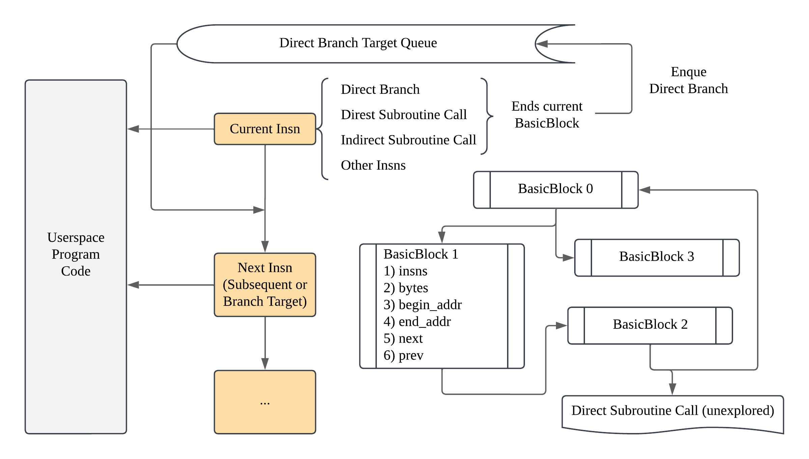
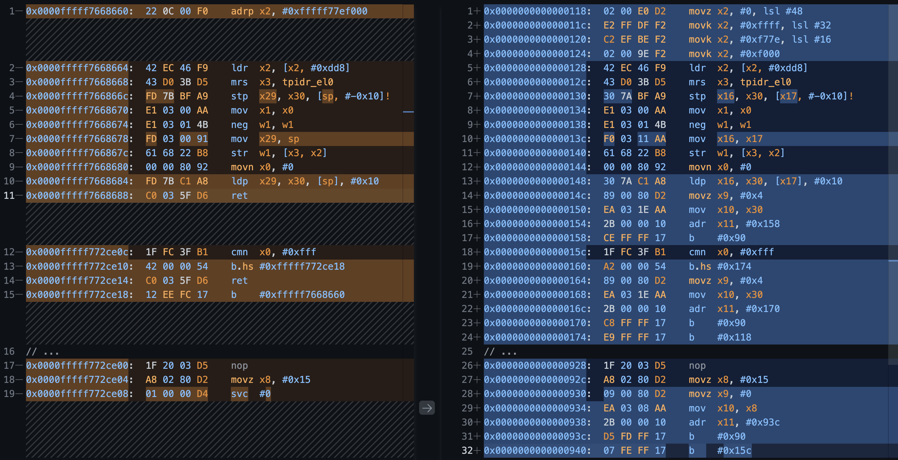

# KJIT

## Introduction 

This kernel module provides a framework for userspace code JIT in kernel. It utilizes [Capstone](https://www.capstone-engine.org) for disassembly coupled with a handwritten assembler to produce the final output. [Capstone-rs](https://github.com/capstone-rust/capstone-rs) is used to interact with the Captone library.

## Supported Architecture

ARM64

## How to get started?

The module has to be installed on Rust-enabled Linux kernel with Capstone embedded. The Rust features required by this module have yet to be merged into mainline kernel. That is to say, for a really quick start, I have provided a fork from the repository [Rust-for-Linux](https://github.com/Rust-for-Linux/linux/tree/rust-dev) at [linux-w-capstone](https://github.com/haroldxie2308/linux-w-capstone) with Capstone embedded. 

Let's assume you are already familiar with [the documentation of developing with Rust in kernel](https://docs.kernel.org/rust/quick-start.html) (pay attention to building the kernel and prepare rust-analyzer for better coding experience) and have read through some tricks on writing out-of-tree modules (like how to initialize and build some basic modules).

If you have not done so, here are some good places to start:

- [Rust out-of-tree-module](https://github.com/Rust-for-Linux/rust-out-of-tree-module) 
- [Mentorship Session: Writing Linux Kernel Modules in Rust](https://youtu.be/-l-8WrGHEGI?si=WdSXm-_bFWczCrf_) 

After you've watched loads of videos and read through lines of code online, it's time to get your hand dirty!

1. Make sure you have an ARM64 server/laptop/PC to work with (or "to meddle with", to be precise ;) )
2. Download [linux-w-capstone](https://github.com/haroldxie2308/linux-w-capstone) and build the kernel with Rust enabled
3. Install the newly built kernel to your machine (you'd better experiment this with virtual machine or qemu before actually install it on the real one)
4. Clone this git repo, modify *KDIR* in **Makefile** and run `make rust-analyzer` 
5. Make the module, load it and start experimenting with SVC intensive applications!
6. `make dm` in another terminal to register a log of the `dmesg` content 

**Important Note: your device will probably stuck on starting running SVC intensive applications, this is probably due to unknown bugs in the UCA module.**

## Implementation Detail

### Project overview

The idea of UCA module came from [Userspace Bypass: Accelerating Syscall-intensive Applications](https://www.usenix.org/conference/osdi23/presentation/zhou-zhe). Please refer to Zhe ZHOU et al.'s paper for more detail of the design and a workable kernel module for x86-64 platform.

### The design of the Control Flow Analysis method of `struct Translator`.

### Original code compared to JITed code

## Usage

The JITed code can be executed by following some conventions stated in the description of the `trans` module. The UCA module is an example use case of the KJIT framework. Pay attention to *prelude* and *epilogue* variable in `code_gen()` for calling and returning conventions of the function generated by the framework. Also peruse the `code_lifter` module under UCA to better understand how to interact with this framework and how to interpret different return values.

## License

This project is licensed under the **GNU General Public License v2.0 (GPLv2)**.

Additionally, this project includes a component licensed under the **MIT License** (capstone-rs). The MIT-licensed component remains under its original license, and its terms can be found in the corresponding [source file](./trans/cs_rust/LISCENSE). 