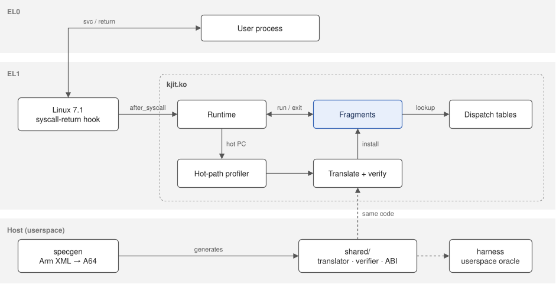
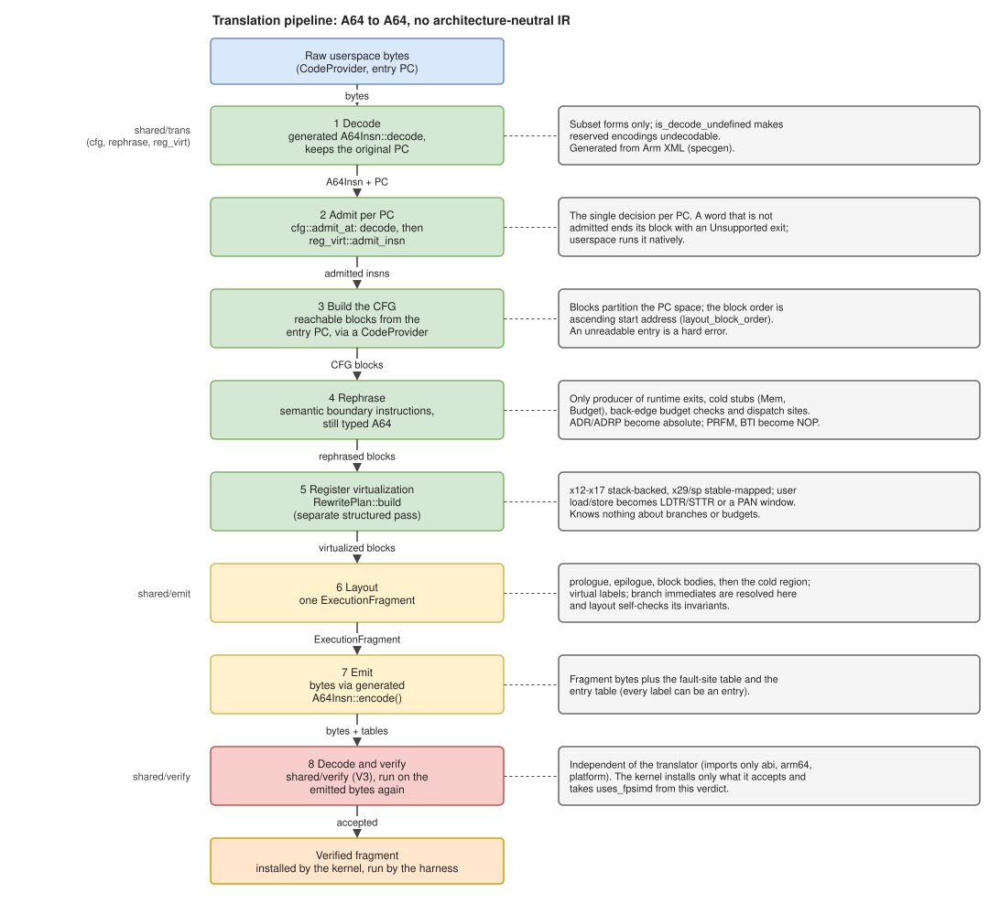
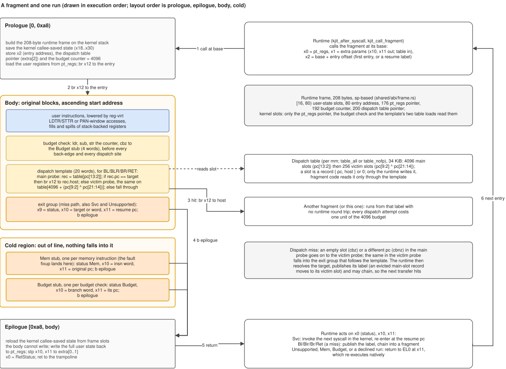

# KJIT

KJIT translates hot userspace, syscall-adjacent AArch64 code into kernel-space
executable code, so a program can issue its next syscalls without returning to
EL0 in between. Idea and prior art: [Userspace Bypass: Accelerating
Syscall-intensive Applications](https://www.usenix.org/conference/osdi23/presentation/zhou-zhe)
(OSDI '23, x86-64); KJIT targets ARM64 only.

```text
raw userspace bytes -> generated typed A64Insn -> raw kernel-safe bytes
```

Status: a research prototype that runs unmodified programs (redis's own test
suite included) with the same observable behaviour as native. Speed is not a
goal yet: semantic equivalence comes first, and today redis under KJIT is
slower than native (see [Latest results](#latest-results)).

- **Goal.** A translated program behaves exactly as it does natively. Wherever
  a fragment cannot or should not run an instruction in the kernel it exits to
  userspace at that instruction, which re-executes natively, so declining is
  always exact. The kernel runs only fragments that an independent verifier
  accepted, and touches user memory only through instructions that carry EL0
  permissions.
- **Non-goals.** x86 or any other architecture; a generic JIT framework; an
  Arm decoder beyond the selected A64 subset (`spec/arm64/subset.toml`);
  performance work before semantic equivalence; kernel-first debugging of
  translator bugs.

The precise contracts (ABI, privilege model, verifier rules, runtime rules) live
in [`docs/pipeline.md`](docs/pipeline.md); measurements, findings and
implementation records live in [`docs/journal/`](docs/journal/). This README
links to them instead of repeating them.

## How it works



1. A patched Linux 7.1-rc1 calls a hook after every syscall that has no
   syscall work. The hook belongs to `kjit.ko`, which looks up a translated
   fragment for the resume PC (`regs->pc`) of the current mm.
2. If a fragment exists and the run conditions hold, the module runs it in the
   kernel through a call trampoline. The fragment executes the user's code at
   EL1 with its registers virtualized, and ends in a runtime exit: an `svc`
   (the hook returns that syscall number, the kernel invokes it without a
   return to EL0, and the run re-enters), a branch it could not dispatch, or
   a decline.
3. Anything the fragment cannot handle returns to userspace at the exact
   instruction (an `Unsupported`, `Mem` or `Budget` exit, a user-memory fault,
   a declined syscall), and the program carries on natively.
4. Fragments come from the translator in `shared/`, which is independent of
   where it runs. In the kernel it runs at install time; the verifier then
   re-checks the emitted bytes. The userspace harness runs the same code, so
   translation correctness is proven in userspace before any kernel execution.
5. Hot code is found by the K3 auto mode (a per-mm profiler that queues a
   translation as `task_work`), or by a manual debugfs trigger.

### Translation pipeline



The pipeline stays A64-to-A64; there is no architecture-neutral IR. Unknown
dynamic targets always return to the runtime, and no fragment branches to a raw
user-controlled address. Pass contracts: [`docs/pipeline.md`, section
2](docs/pipeline.md#2-architecture-and-translation-pipeline) and [section
4](docs/pipeline.md#4-translator-contracts).

### A fragment and a run



Every fragment is called at its base with `x0 = pt_regs`, `x1 = extra params`,
`x2 = base + entry offset`. The prologue and epilogue are byte-exact and
verified; the body runs the user's instructions; every way out is an exit group
(`x9` = status, `x10`/`x11` = parameters) that ends in `b <epilogue>`. ABI,
frame layout and statuses: [section 3](docs/pipeline.md#3-fragment-abi).

### Safety model

- **Verifier (V3).** `shared/verify/` checks the final bytes, the fault-site
  table and the entry table using only the generated decoder and `shared/abi`,
  never the translator: byte-exact prologue and epilogue, no write to SP or
  x29, user memory touched only through `LDTR*`/`STTR*` with a fault-site entry
  or inside an exact PAN window, no kernel value leaking into user-visible
  state, every back-edge budget-charged, no indirect branch except the
  prologue's and a byte-exact dispatch template's. Rules:
  [section 6](docs/pipeline.md#6-verifier-v3). A mutation suite requires every
  deterministic mutation of every fixture fragment to be rejected.
- **Privilege model.** Every user load/store is lowered to the unprivileged
  `LDTR`/`STTR` family; LSE atomics and SIMD&FP accesses, which have no
  unprivileged form, run as the one privileged access of a PAN window behind a
  range check. A fault leaves through the access's `Mem` stub and userspace
  re-executes the instruction natively, so signals behave as without KJIT.
  [Privilege model](docs/pipeline.md#privilege-model).
- **Execution budget.** Every back-edge and every dispatch attempt is charged
  to a 4096-unit counter, so a fragment cannot pin a CPU in the kernel.
  [Execution budget](docs/pipeline.md#execution-budget-a6).
- **Run conditions.** No ptrace, no seccomp, no pending signal, reschedule or
  `task_work`, `enable` set; checked at every runtime entry and every in-kernel
  syscall. [Run conditions](docs/pipeline.md#run-conditions-kjit_can_run).

### In-fragment dispatch (A11)

`BL`, `BLR`, `BR` and `RET` do not leave the fragment on every execution.
Each is lowered to a budget check, the target in `x13`, the link write, and a
byte-exact 20-word template that probes a per-mm table (34 KiB: a
direct-mapped main part of 4096 slots indexed by `pc[13:2]`, then a 256-slot
victim part indexed by `pc[9:2] ^ pc[21:14]`, slots pointing at `{pc, host}`
records) and `br`s to the host of a matching record. Only a miss in both parts
takes the old exit group into the runtime, which resolves the target and
publishes its label; a record that the publish evicts from the main part moves
to its own victim slot. Fragments never write text or tables, so
unlinking is one store by the runtime, and retired fragments are freed after a
hook-SRCU grace period. Contract:
[In-fragment branch dispatch](docs/pipeline.md#in-fragment-branch-dispatch-a11)
and [Dispatch tables](docs/pipeline.md#dispatch-tables-a11-kernel-side).

### FP/SIMD bracket (A9)

V0-V31, FPCR and FPSR are never virtualized; they stay live in hardware. A
fragment that the verifier reports as `uses_fpsimd` therefore runs inside a
bracket: `local_bh_disable()`, reload the user FP/SIMD state if
`TIF_FOREIGN_FPSTATE`, `pagefault_disable()`, run, undo. With page faults
disabled, any fault of such a run leaves through its `Mem` stub. A bracketed
run dispatches through `table_all`, a non-FP/SIMD run through `table_nofp`, so
code outside the bracket can never reach FP/SIMD code. The bracket currently
spans a whole run, which is an open decision on preemption latency
([section 11](docs/pipeline.md#11-open-decisions-and-known-limitations)).
Systems with SVE or SME refuse such fragments. Contract:
[FP/SIMD in fragments](docs/pipeline.md#fpsimd-in-fragments-a9).

### K3 auto mode

With `auto` on, unmodified programs are accelerated without any trigger. After
every syscall whose resume PC has no fragment, and after every `Bl`/`Blr`/`Br`/
`Ret` exit whose target has none, the hook counts a hit of that PC in a bounded
per-mm table; `hot_threshold` hits (default 64) within `hot_window_ms`
(default 100) make it hot. A hot PC is queued as `task_work` and translated at
the task's next return to user mode, from its own mm, under the same rules and
verification as the manual trigger. Failures that would repeat go to a per-mm
negative cache; per-mm and global caps bound fragments and code. Contract:
[section 9](docs/pipeline.md#9-automatic-hot-path-detection-k3).

## Repository layout

| Path | What |
|---|---|
| `spec/arm64/subset.toml`, `specgen/` | Supported Arm XML subset and the Rust generator of `A64Insn` (decode, encode, operand roles); output in `spec/arm64/generated/` |
| `shared/` | `no_std + alloc` code for both userspace and kernel: `arm64`, `trans` (cfg, rephrase, reg_virt), `emit` (layout), `abi`, `verify`, `platform` |
| `harness/` | Userspace proving ground: interpreter, `URuntime` (the kernel executor's model), native hardware runner, differential fuzzer, trace TUI, coverage tools. `harness/src/shared/` is a synced copy of `shared/` |
| `runtime/`, `rust_kjit.rs`, `kjit_glue.c`, `Kbuild` | The kernel module `kjit.ko`: Rust (hook decision, translate and verify at install, stats) and C (hook registration, per-mm code cache, trampoline, K3 auto mode, debugfs) |
| `kernel-patches/` | Seven patches on the pinned `dep/linux` (7.1-rc1): syscall-return hook, extable lookup, execmem exports, `task_work`, FP/SIMD restore, unload ordering, SRCU callback queue ([patch series](docs/pipeline.md#patch-series)) |
| `kernel-config/` | Kernel config fragments: tiny QEMU profiles, guest profiles, the K1 invariants |
| `tests/arm64/` | Assembly fixtures for the harness; `tests/guest/` guest tests and the redis campaign |
| `scripts/`, `docker/` | Dev container, kernel build, QEMU, guest rootfs and campaign scripts |
| `tools/` | `e0` (syscall cost benchmark), `e1-trace` (dynamic trace of redis under QEMU TCG) |
| `docs/` | [`pipeline.md`](docs/pipeline.md): goals, architecture, current contracts; [`journal/`](docs/journal/): dated experiments, measurements, records |
| `figs/` | draw.io sources and exported SVGs of the figures above |
| `AGENTS.md` | Working rules for AI agents in this repo |

`shared/` is the source of truth; edit it there and run `make harness-sync`
(also done by `make harness-prepare` and `make prepare`). Generated A64 code is
never edited by hand: change `spec/arm64/subset.toml` or `specgen/`, then
`make spec-gen`.

## Build and run

### Userspace: harness (no kernel needed)

Prerequisites: a Rust toolchain; `llvm-mc`, `llvm-nm` and `llvm-objcopy` on
`PATH` (for example Homebrew `llvm`); Docker for the native-hardware oracle on
macOS.

```sh
make harness-test            # unit tests, fixture differential check, verifier mutation suite, fuzz slice
make harness-test-native     # adds the host CPU as a third oracle (linux/arm64 container on macOS)
make fuzz SEED=1 ITERS=200000          # differential fuzzer; FUZZ_ARGS=... for more options
make harness-test-asm ASM=tests/arm64/toy_cfg.s    # one fixture, full pipeline check
make harness-dump-cfg        # CFG dump of the toy fixture
make harness-tui ASM=tests/arm64/toy_cfg.s         # interactive trace explorer (OpenTUI)
make coverage-scan ELF=path/to/aarch64.elf         # how far the translator gets on a real binary
make e1-trace                # dynamic trace of redis between syscalls (needs Docker)
make spec-gen                # regenerate A64 code from subset.toml (needs the Arm ISA XML, see ARM64_ISA_XML_DIR)
make spec-test-encoding      # generated encodings against LLVM's assembler
```

`make harness-test` runs the full-pipeline differential check on every case of
every `tests/arm64/*.s` fixture. A case is a defined symbol ending in `_mark`;
its address is the hot SVC PC and translation starts at `symbol + 4`. Every
fixture needs at least one case, and adding one covers it automatically. The
harness layers are described in [section
7](docs/pipeline.md#7-harness-contracts).

### Kernel: dev container, patched tree, guest images

Kernels build out of tree only, from a patched worktree of the `dep/linux`
submodule (`$KJIT_BUILD_ROOT/linux-kjit`, the `kernel-patches/` series applied
by `scripts/kjit-kernel-tree.sh`). `dep/linux` stays clean. Build-oriented
targets run in the Linux dev container; QEMU runs on the host (HVF on an Apple
Silicon Mac). `.kjit.env` (copy `.kjit.env.example`) holds optional local
overrides.

```sh
git submodule update --init dep/linux
export KJIT_BUILD_ROOT=/Volumes/CaseSentitiveLocal/kjit-build     # optional; must be case-sensitive
make kernel-tree KJIT_LINUX_GIT=/path/to/KJIT/dep/linux           # host: create/update the patched tree
./scripts/docker-dev.sh --build-image -- true                     # build the dev image
./scripts/docker-dev.sh -- make guest-kernel                      # kernel + kjit.ko, profile kjit-guest
./scripts/docker-dev.sh -- make guest-kernel-debug                # + KASAN, lockdep, DEBUG_ATOMIC_SLEEP
make guest-rootfs                                                 # host: Debian + redis 7.0.15 + guest tests -> rootfs.cpio
```

Profiles (`KJIT_KERNEL_PROFILE`, fragment lists in `scripts/setup-kernel-build.sh`,
all ending in the K1 invariants of
[`kernel-config/kjit-invariants.conf`](docs/pipeline.md#kernel-config-invariants-k1)):

| Profile | Use |
|---|---|
| `tiny-qemu`, `tiny-qemu-debug` (default) | K0: boot, golden fragment check, load and unload |
| `kjit-guest` | Debian bookworm + redis in an initramfs: K2/K3 guest tests, the redis campaign |
| `kjit-guest-debug` | `kjit-guest` + generic KASAN, lockdep, `DEBUG_ATOMIC_SLEEP`, `DEBUG_LIST` |

K0 smoke test: after `make kernel-tree`, run `./scripts/docker-dev.sh -- make
kernel-prepare kernel-build module-build initramfs`, then `make qemu-run` on
the host. At init `kjit.ko` compiles a
built-in fixture and compares it with `tests/arm64/golden/`; after a deliberate
translator change regenerate it with `make kernel-golden`.

Other targets: `make prepare` (tiny profile kernel + harness sync),
`make rust-analyzer`, `make qemu-run-bg`, `make qemu-reset`, `make pack`,
`make help`.

### Running programs in the guest

```sh
make guest-run GUEST_PROFILE=kjit-guest CMD='redis-server --daemonize yes --save "" --appendonly no; sleep 1; redis-benchmark -q -n 10000'
make guest-run GUEST_PROFILE=kjit-guest CMD=sh        # interactive shell on the serial console
make e0-bench GUEST_PROFILE=kjit-guest                # cost of a syscall, native vs guest
```

`scripts/guest-run.sh` boots one QEMU guest per run: it shares a run directory
(command, a copy of the profile's `kjit.ko`, `serial.log`) over virtio-9p, the
guest `/init` loads the module, runs the command, unloads the module and powers
off. The run fails if the command did not exit 0, on a QEMU timeout, if the boot
lacks `CPU features: detected: Privileged Access Never`, or if any kernel line
reports `BUG:`, `WARNING:`, an oops, a panic, `Call trace:`, lockdep `INFO:` or
an RCU stall. Pass `--module none` to the script to skip the module.

### Guest tests

```sh
make guest-tests GUEST_PROFILE=kjit-guest              # K2: micro tests in tests/guest, KJIT off vs on
make guest-tests GUEST_PROFILE=kjit-guest-debug K2_ITERATIONS=100
make guest-tests-k3 GUEST_PROFILE=kjit-guest           # K3: real programs under the auto mode
make guest-tests-k3 GUEST_PROFILE=kjit-guest-debug K3_ITERATIONS=20
```

Every test runs with KJIT disabled and enabled and must print the same output
with the same exit status; the enabled run also checks counters (for example
`toy_loop` must issue at least 99% of its syscalls in the kernel). The tests
cover memory forms, faults, copy-on-write, the budget, calls through dispatch
(`call_loop`, `alias_loop`, `link_race`), signals, `munmap` races, seccomp,
ptrace, FP/SIMD (`fp_*`), `kill -9`, and module unload under load. K3 adds
coreutils, `epoll`/pipe workloads, a redis smoke test and an unload stress.

### Redis campaign (K4)

The target workload is redis 7.0.15 in the guest under the auto mode. The
campaign boots one guest per step and prints a PASS/FAIL line per step and
`k4-campaign: RESULT PASS|FAIL`:

```sh
make redis-campaign GUEST_PROFILE=kjit-guest
make redis-campaign GUEST_PROFILE=kjit-guest-debug K4_ITERATIONS=10
make redis-campaign K4_ARGS=--no-suite                 # only benchmark + adversarial
```

1. The full default `runtest` suite without and with `kjit.ko`: the same
   outcome for every test.
2. `redis-benchmark` runs with the KJIT counter deltas, and a deterministic
   dataset whose `DEBUG DIGEST` must be identical KJIT off and on.
3. Adversarial tests, each off and on with identical output: `kill -9`,
   SIGTERM/SIGUSR1/SIGSTOP, `DEBUG SEGFAULT`, BGSAVE and AOF rewrites under
   load with restarts, `maxmemory` eviction, `rmmod`/`insmod` under load.

Pass criteria and exclusions: [section
10](docs/pipeline.md#10-validation-of-the-kernel-runtime-k2-k4).

## Module interface

`kjit.ko` refuses to load (`-ENODEV`, naming the cause) on a CPU without the
features its translated code relies on (FEAT_LSE2 with `SCTLR_EL1.nAA` clear,
FEAT_LRCPC, FEAT_CRC32, FEAT_LSE, 48-bit VA, no MTE in use, `SCTLR_EL1.SPAN`
clear, EL0 counter access on every online CPU). Kernel config requirements:
[K1 invariants](docs/pipeline.md#kernel-config-invariants-k1) and
[Preconditions](docs/pipeline.md#preconditions).

Module parameters: `auto`, `hot_threshold`, `hot_window_ms`, `chain_budget`,
`max_frags_per_mm`, `max_code_per_mm`, `max_frags_total`, `max_code_total`
(for example `insmod kjit.ko auto=1`).

debugfs, `/sys/kernel/debug/kjit/` (root only):

| File | Use |
|---|---|
| `translate` | write `"<pid> <pc>"`: translate that entry PC |
| `translate_svc_sites` | write `"<pid>"`: translate `svc_pc + 4` for every SVC word in the process's executable, non-writable mappings |
| `enable` | `Y`/`N`: global switch; also stops fragment runs at the next run-condition check |
| `auto`, `hot_threshold`, `hot_window_ms` | K3 auto mode |
| `chain_budget` | runtime fragment entries per hook call (1..65536, default 1024) |
| `stats` | counters: translations by outcome, syscalls in the kernel, hook calls, fragment entries, chains, exits by status, the K3 `auto_*` counters, FP/SIMD bracket counters, dispatch-table `ibtc_*` counters and the miss classification `ibtc_miss_cold`/`ibtc_miss_conflict`/`ibtc_miss_other` |
| `unsupported_top` | `word exits entry_stops` per line, most frequent first: ranks the next coverage work from real runs |
| `ibtc_slots` | per-table dispatch slots with the most conflict misses; write `reset` to zero them |

```sh
mount -t debugfs debugfs /sys/kernel/debug
echo $PID > /sys/kernel/debug/kjit/translate_svc_sites
cat /sys/kernel/debug/kjit/stats
```

A translation whose entry instruction itself would take the `Unsupported` exit
is refused (`-ENOEXEC`). Counter semantics: [section
8](docs/pipeline.md#8-kernel-runtime-k2) and
[section 9](docs/pipeline.md#9-automatic-hot-path-detection-k3).

## Latest results

All numbers are from an Apple M1 host, HVF, 4 vCPUs, the `kjit-guest` profile,
with other work running on the host (load 4-12): good for ratios and counters,
not for absolute speed.

- **A11 integration (2026-10-05)**, [`docs/journal/2026-10-05.md`, "A11
  integration"](docs/journal/2026-10-05.md). `make harness-test`,
  `harness-test-native` and `fuzz` clean; `guest-tests` and `guest-tests-k3`
  pass on both guest profiles. Redis campaign on `kjit-guest`: `RESULT PASS`,
  suite 2864 / 2866 tests passed without / with KJIT, 0 failed, the same
  outcome for all 2518 distinct tests; 41.6% of the suite's syscalls ran in
  the kernel; no verifier rejection or invalid exit. Benchmark: 76.5%
  (default), 60.2% (`-P 16`) and 76.7% (256 clients) of the server's syscalls
  in the kernel, about 9 runtime fragment entries per in-kernel syscall
  (about 140 before A11). redis-benchmark SET / GET: 119k / 144k requests/s
  with KJIT against 230k / 231k with it off (1.9x / 1.6x slower; 4.2x / 3.8x
  before A11). On `kjit-guest-debug` two of three campaign runs failed one
  redis test each that does not depend on KJIT (a 30 ms latency assertion that
  also failed once with KJIT disabled, and a `FAILOVER` exception in the run
  without `kjit.ko`); the third passed.
- **Dispatch-table miss classification (2026-10-09)**, [`docs/journal/
  2026-10-09.md`, "Dispatch-table miss
  classification"](docs/journal/2026-10-09.md). Besides the by-design FP/SIMD
  boundary, the runtime entries that remain after A11 are almost entirely
  conflict misses of the direct-mapped table: per SET request about 18.5
  conflict misses of 28.5 runtime entries (GET about 8.8 of 15.9), against
  cold misses below 0.02. Conflicts concentrate in 5 to 17 slots per table,
  mostly two-pc ping-pongs between redis functions 16 KiB apart. The table is
  not too small but direct-mapped on `pc[13:2]`; hit rate is not measured, and
  the cost of the instrumentation was not resolvable within host noise.
- **Known limits.** The in-kernel path stops at words the subset does not
  cover (exclusives, floating-point arithmetic, register-offset SIMD&FP
  accesses, PAC hints, ...), which take the exact `Unsupported` exit. Open
  decisions (FP/SIMD bracket length, table shape, where the remaining
  slowdown sits) and not-verified items are listed in [section
  11](docs/pipeline.md#11-open-decisions-and-known-limitations).

## Contributing and docs

- Read `AGENTS.md` first (it is binding for agents and a good summary for
  people): scope, layering, definition of done per change type.
- Contracts first: write or rewrite the contract in `docs/pipeline.md` before
  implementing it, and record every experiment, measurement and decision as a
  timestamped entry in `docs/journal/<date>.md`.
- Keep this README aligned with the architecture and workflow; the figures in
  `figs/` are draw.io files, edit `figs/<name>.drawio` and export with
  `draw.io --export --format svg --output figs/<name>.svg figs/<name>.drawio`.
- The previous implementation (`old-version/`) was removed; recover it from git
  history as described in `AGENTS.md`.

## Editor setup

`docker/dev/Dockerfile` defines the Linux dev image used for kernel builds and
editors. Open the repo in VS Code and reopen it in the dev container
(`.devcontainer/`; run `make prepare && make rust-analyzer` inside, and use the
`KJIT:` tasks), or start the same environment from a terminal with
`./scripts/docker-dev.sh --build-image` (later `./scripts/docker-dev.sh`).
`scripts/setup-dev-editor.sh` links a toolchain-matched `rust-analyzer` at
`/workspace/.kjit/bin/rust-analyzer` and configures Neovim; generate
`rust-project.json` inside the container with `make rust-analyzer`. The Docker
wrapper sets `HOME=/workspace/.kjit/docker-home`, so shell and editor config
persist under the repo-local `.kjit/`.

## License

GNU General Public License v2.0 (GPLv2), see [`LISCENSE/GPLv2`](LISCENSE/GPLv2).
The removed old implementation vendored capstone-rs under the MIT License; it
remains available, with its own license file, in git history.
